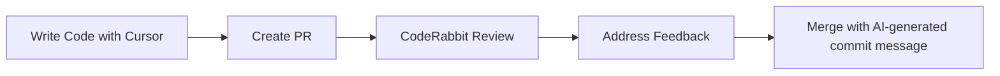

Football Field Reservation App - Planning with AI

> **🎯 Project Planning Phase**: Designing an AI-enhanced development approach for a football field reservation system in Tunis with weather integration

## 🌟 Project Idea

### **Football Field Reservation System for Tunis with Weather Integration**

A web application that allows users to browse and reserve football fields across the three major cities of Tunis (Tunis, Ariana, Ben Arous) with integrated weather forecasting to help users make informed booking decisions.

#### **Why This Project?**
- **Meaningful**: Solves a real problem for football enthusiasts in Tunisia
- **Achievable**: Realistic scope for capstone timeline (7 days)
- **Engaging**: Combines multiple interesting technologies (weather APIs, booking systems, location services)
- **AI-Friendly**: Multiple opportunities for AI-assisted development across different domains

#### **Core Problem Solved**
Currently, booking football fields in Tunis requires calling multiple facilities, with no way to check weather conditions for planned matches. This app centralizes bookings and adds weather intelligence for better decision-making.

## 🛠️ Tech Stack Selection

### **Frontend**
- **Framework**: Next.js 14 with App Router
  - *Rationale*: Full-stack capabilities, excellent TypeScript support, great for AI code generation
- **Language**: TypeScript
  - *Rationale*: Better AI assistance with type safety, easier refactoring
- **Styling**: Tailwind CSS + Shadcn/ui
  - *Rationale*: Rapid UI development, AI-friendly component generation
- **State Management**: React Context + useReducer
  - *Rationale*: Simple, built-in, easy for AI to understand and generate

### **Backend**
- **API**: Next.js API Routes
  - *Rationale*: Seamless full-stack development, excellent for AI code generation
- **Database**: PostgreSQL with Prisma ORM
  - *Rationale*: Prisma provides excellent TypeScript integration and AI-friendly schema management
- **Authentication**: NextAuth.js
  - *Rationale*: Industry standard, well-documented, AI can easily generate auth flows

### **External Services**
- **Weather API**: OpenWeatherMap (free tier)
  - *Rationale*: Comprehensive weather data, free tier available, well-documented for AI integration
- **Deployment**: Vercel
  - *Rationale*: Seamless Next.js deployment, generous free tier

### **Development Tools**
- **Primary IDE**: Cursor
- **Code Review**: CodeRabbit
- **Version Control**: Git + GitHub
- **Testing**: Jest + React Testing Library

## 🤖 AI Integration Plan

### 🧱 **Code or Feature Generation**

#### **Primary AI Tools**: Cursor IDE + GitHub Copilot

**Specific Usage Strategy:**

1. **Component Scaffolding**
   - Use AI to generate React components with proper TypeScript interfaces
   - Generate form components with validation using react-hook-form + Zod
   - Create UI components following Shadcn/ui patterns

2. **API Route Generation**
   - Generate CRUD operations for fields, reservations, and users
   - Create weather API integration functions
   - Generate authentication middleware and route protection

3. **Database Schema & Operations**
   - Use AI to design Prisma schema based on requirements
   - Generate type-safe Prisma queries and mutations
   - Create database seeding scripts with realistic data

4. **Business Logic Functions**
   - Weather-based booking recommendations algorithm
   - Availability checking and conflict resolution
   - Pricing calculation with weather factors

**Example AI-Generated Features:**
```typescript
// AI will help generate components like this:
interface FieldCardProps {
  field: Field;
  weatherData: WeatherData;
  onReserve: (fieldId: string) => void;
}

const FieldCard: React.FC<FieldCardProps> = ({ field, weatherData, onReserve }) => {
  // AI-generated component logic
};
```

### 🧪 **Testing Support**

#### **AI-Assisted Testing Strategy:**

1. **Unit Test Generation**
   - Generate tests for utility functions (date validation, price calculations)
   - Create tests for weather API integration functions
   - Generate validation schema tests using Zod

2. **Component Testing**
   - Use AI to create React Testing Library tests
   - Generate user interaction tests (form submissions, button clicks)
   - Create accessibility and responsive design tests

3. **API Integration Tests**
   - Generate tests for all CRUD operations
   - Create authentication flow tests
   - Generate weather API mock responses and tests

4. **Test Data Generation**
   - AI-generated realistic test data for fields, users, reservations
   - Mock weather data for different conditions
   - Edge case test scenarios

**Sample AI Testing Prompt:**
```
"Generate comprehensive Jest tests for a football field reservation validation function that checks:
- Date is not in the past
- Time slot doesn't conflict with existing bookings
- Field is available during requested hours
- Weather conditions meet playability requirements
Include edge cases and error scenarios."
```

### 📡 **Schema-Aware or API-Aware Generation**

#### **Prisma Schema-Driven Development:**

1. **Type-Safe Database Operations**
   - Use Prisma schema to generate TypeScript types
   - AI will create functions based on schema relationships
   - Generate CRUD operations that respect foreign key constraints

2. **API Route Generation Based on Schema**
   - Create RESTful endpoints following OpenAPI specifications
   - Generate request/response validation based on Prisma models
   - Create middleware for data transformation and serialization

3. **Weather API Integration**
   - Generate TypeScript interfaces from OpenWeatherMap API documentation
   - Create wrapper functions that transform external API responses to internal types
   - Build caching layer for weather data based on API response structure

**Schema-Aware Example:**
```prisma
// Prisma schema will drive AI code generation
model Field {
  id            String        @id @default(cuid())
  name          String
  city          City
  reservations  Reservation[]
}

model Reservation {
  id       String @id @default(cuid())
  fieldId  String
  field    Field  @relation(fields: [fieldId], references: [id])
}
```

AI will generate functions like:
```typescript
// Auto-generated based on schema relationships
async function getFieldWithReservations(fieldId: string): Promise<FieldWithReservations> {
  // AI-generated Prisma query with proper types
}
```

## 🔧 In-Editor/PR Review Tooling Plan

### **Primary Tool: Cursor IDE**

**Usage Strategy:**
- **Real-time Code Generation**: Use Cursor's AI to generate components, functions, and tests
- **Context-Aware Suggestions**: Leverage Cursor's file understanding for better code completion
- **Refactoring Assistance**: Use AI to improve code structure and performance

**Cursor Configuration:**
- Set up project-specific AI context with our tech stack preferences
- Configure custom prompts for our domain (football fields, weather, reservations)
- Enable TypeScript-aware suggestions for better type safety

### **Secondary Tool: CodeRabbit for PR Reviews**

**How it will support development:**
1. **Automated Code Reviews**
   - Analyze pull requests for code quality issues
   - Check for security vulnerabilities
   - Ensure consistent coding patterns

2. **Commit Message Generation**
   - Generate meaningful commit messages following conventional commits
   - Create descriptive PR titles and descriptions
   - Auto-generate release notes

3. **Code Quality Metrics**
   - Track technical debt accumulation
   - Monitor test coverage improvements
   - Identify refactoring opportunities

**Review Process:**


## 💬 Prompting Strategy

### **Effective Prompt Templates**

#### **1. Component Generation Prompt**
```
"Generate a TypeScript React component for displaying football field booking cards with the following requirements:
- Display field name, location (city), price per hour, and available facilities
- Show current weather conditions with temperature and weather icon
- Include a 'Book Now' button with loading state
- Use Tailwind CSS for styling with mobile-responsive design
- Include proper TypeScript interfaces for props
- Handle loading and error states gracefully
- Follow our existing design system using Shadcn/ui components

Context: This is for a football field reservation app in Tunis with weather integration using Next.js 14 and Prisma."
```

#### **2. API Development Prompt**
```
"Create a Next.js API route for handling football field reservations with these specifications:
- Method: POST /api/reservations
- Input validation using Zod schema
- Check for booking conflicts using Prisma queries
- Integrate weather data from OpenWeatherMap API
- Send confirmation email using Nodemailer
- Return proper HTTP status codes and error messages
- Include TypeScript interfaces for request/response
- Implement proper error handling and logging

Database schema context: [provide relevant Prisma models]
Authentication: Uses NextAuth.js with JWT tokens"
```

#### **3. Testing Generation Prompt**
```
"Generate a comprehensive test suite for the football field availability checking function with:
- Unit tests using Jest and React Testing Library
- Test cases for date validation (no past dates)
- Conflict detection with existing reservations
- Field operating hours validation
- Weather-based availability scoring
- Edge cases: holidays, maintenance periods, extreme weather
- Mock Prisma database calls and weather API responses
- TypeScript type safety throughout tests

Function signature: checkFieldAvailability(fieldId: string, date: Date, startTime: string, endTime: string)
Returns: Promise<AvailabilityResult>"
```

## 📅 Development Timeline & AI Usage

### **Week 1: AI-Enhanced Development Plan**

**Day 1-2: Foundation**
- Use AI to set up project structure and configuration
- Generate Prisma schema with AI assistance
- Create basic UI components using Cursor

**Day 3-4: Core Features**
- AI-generated API routes for CRUD operations
- Weather API integration with AI assistance
- Authentication flow generation

**Day 5-6: Enhancement**
- AI-generated tests for all major features
- UI/UX improvements with AI suggestions
- Performance optimization with AI analysis

**Day 7: Polish & Deploy**
- CodeRabbit PR reviews and final improvements
- AI-assisted deployment and documentation

## 📊 Success Metrics for AI Integration

### **Quantitative Goals**
- **70%+ of components** generated with AI assistance
- **90%+ test coverage** achieved through AI-generated tests
- **50% reduction** in development time compared to manual coding
- **Zero security vulnerabilities** caught by AI code review

### **Qualitative Goals**
- Consistent code quality across the entire codebase
- Proper TypeScript usage throughout the application
- Comprehensive error handling and user feedback
- Professional-grade documentation and comments

## 🎯 Expected Learning Outcomes

### **AI Tool Mastery**
- Advanced prompting techniques for complex development tasks
- Effective use of context in AI-assisted development
- Integration of multiple AI tools in a cohesive workflow

### **Technical Skills**
- Full-stack TypeScript development with Next.js
- Database design and management with Prisma
- External API integration and data transformation
- Modern testing practices and automation

### **Project Management**
- AI-enhanced planning and task breakdown
- Iterative development with AI feedback loops
- Quality assurance through automated AI reviews

---

**🚀 Ready to begin AI-enhanced development!** This plan demonstrates intentional AI integration across all phases of development, from initial scaffolding to final deployment, while building a meaningful application that solves real problems for the football community in Tunis.