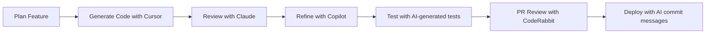

# 📋 Development Log & AI Usage Tracking

## 🎯 Project Progress Tracker

### Development Timeline

| Phase | Task | Status | AI Tools Used | Completion Date |
|-------|------|--------|---------------|-----------------|
| **Setup** | Project initialization | ⏳ Planned | Cursor, GitHub Copilot | - |
| | Database schema design | ⏳ Planned | Claude, Cursor | - |
| | Weather API integration | ⏳ Planned | Claude, CodeRabbit | - |
| | UI components setup | ⏳ Planned | v0.dev, Cursor | - |
| **Core** | Field listing page | ⏳ Planned | Cursor, Copilot | - |
| | Reservation system | ⏳ Planned | Claude, CodeRabbit | - |
| | User authentication | ⏳ Planned | Cursor, Copilot | - |
| | Weather integration | ⏳ Planned | Claude, Cursor | - |
| **Polish** | Testing suite | ⏳ Planned | CodeRabbit, Claude | - |
| | Performance optimization | ⏳ Planned | Cursor, CodeRabbit | - |
| | Documentation | ⏳ Planned | Claude, Copilot | - |
| | Deployment | ⏳ Planned | Vercel AI, Claude | - |

## 🤖 AI Tool Usage Strategy

### Primary AI Tools

#### 1. **Cursor IDE** - Primary Development Environment
- **Usage**: Real-time code completion, refactoring, debugging
- **Strengths**: Context-aware suggestions, file understanding
- **Best For**: Component development, API routes, TypeScript interfaces

**Effective Prompts for Cursor:**
```
"Generate a TypeScript React component for displaying football field cards with weather integration. Include proper types, error handling, and Tailwind styling."

"Create a Prisma query to find available time slots for a field on a specific date, excluding existing reservations."

"Refactor this component to use React Query for data fetching with proper loading and error states."
```

#### 2. **GitHub Copilot** - Code Completion
- **Usage**: Autocomplete functions, generate boilerplate code
- **Strengths**: Pattern recognition, quick implementations
- **Best For**: Utility functions, validation schemas, test cases

#### 3. **Claude (Anthropic)** - Architecture & Complex Logic
- **Usage**: System design, complex business logic, documentation
- **Strengths**: Understanding context, explaining concepts
- **Best For**: Database design, API architecture, integration patterns

#### 4. **CodeRabbit** - Code Review & Quality
- **Usage**: PR reviews, code quality checks, suggestion improvements
- **Strengths**: Automated reviews, best practice recommendations
- **Best For**: Code review automation, release notes generation

### AI-Enhanced Development Workflow



## 📝 Daily Development Logs

### Day 1: Project Setup & Planning
**Date**: _[To be filled]_
**Focus**: Project initialization and database design

#### Tasks Completed
- [ ] Next.js project setup with TypeScript
- [ ] Prisma schema design using AI assistance
- [ ] Weather API integration planning
- [ ] UI component library setup (Shadcn/ui)

#### AI Usage
- **Claude**: Database schema design and relationships
- **Cursor**: Project structure and configuration files
- **Copilot**: Package.json scripts and dependencies

#### Challenges & Solutions
_[To be documented during development]_

#### Code Generated
```typescript
// Example: AI-generated Prisma schema snippet
model Field {
  id            String        @id @default(cuid())
  name          String
  city          City
  // ... rest of schema
}
```

#### Prompts That Worked Well
```
"Design a Prisma schema for a football field reservation system with weather integration. Include proper relationships and consider Tunis-specific requirements."
```

#### Lessons Learned
_[To be filled during development]_

---

### Day 2: Core Features Development
**Date**: _[To be filled]_
**Focus**: Field listing and reservation system

#### Tasks Completed
- [ ] Field listing API endpoint
- [ ] Field detail page with weather data
- [ ] Basic reservation form
- [ ] Weather service integration

#### AI Usage
- **Cursor**: Component generation and API routes
- **Claude**: Business logic and data validation
- **CodeRabbit**: Code review and optimization suggestions

#### Code Quality Metrics
- Lines of code written: _[To be tracked]_
- AI-generated vs hand-written ratio: _[To be tracked]_
- Test coverage: _[To be tracked]_

---

### Day 3: User Authentication & Advanced Features
**Date**: _[To be filled]_
**Focus**: User system and enhanced booking features

#### Tasks Completed
- [ ] NextAuth.js setup
- [ ] User dashboard
- [ ] Email notification system
- [ ] Weather-based recommendations

#### AI Assistance Highlights
_[To be documented]_

---

### Day 4: Testing & Optimization
**Date**: _[To be filled]_
**Focus**: Comprehensive testing and performance optimization

#### Tasks Completed
- [ ] Unit tests with AI-generated test cases
- [ ] Integration tests for API endpoints
- [ ] Performance optimization
- [ ] Mobile responsiveness testing

---

### Day 5: Polish & Deployment
**Date**: _[To be filled]_
**Focus**: Final touches and production deployment

#### Tasks Completed
- [ ] UI/UX refinements
- [ ] Error handling improvements
- [ ] Production deployment to Vercel
- [ ] Documentation completion

## 🎯 AI Prompt Templates & Best Practices

### Component Generation Template
```
Context: Football field reservation app for Tunis with weather integration
Task: Generate a [component type] component that [specific functionality]
Requirements:
- TypeScript with proper interfaces
- Tailwind CSS for styling
- Error handling and loading states
- Mobile-responsive design
- Integration with [specific API/service]
Tech Stack: Next.js 14, Prisma, OpenWeatherMap API
```

### API Route Generation Template
```
Create a Next.js API route for [endpoint description]
Methods: [GET/POST/PUT/DELETE]
Input validation: Use Zod schemas
Database: Prisma with [relevant models]
Error handling: Return proper HTTP status codes
Response format: JSON with TypeScript interfaces
Business logic: [specific requirements]
```

### Testing Template
```
Generate comprehensive tests for [component/function name]
Test cases should cover:
- Happy path scenarios
- Error conditions
- Edge cases
- User interactions (if applicable)
Testing framework: Jest + React Testing Library
Mock external dependencies: [API calls, database, etc.]
```

## 📊 AI Effectiveness Metrics

### Code Quality Indicators
- **AI-generated code that worked without modification**: _%_
- **Code requiring minor adjustments**: _%_
- **Code requiring significant changes**: _%_
- **Overall AI assistance satisfaction**: _/10_

### Time Savings Analysis
- **Estimated development time without AI**: _X hours_
- **Actual development time with AI**: _Y hours_
- **Time saved**: _(X-Y) hours_
- **Productivity increase**: _%_

### Feature Implementation Speed
| Feature | Estimated Time (Manual) | Actual Time (AI-assisted) | Time Saved |
|---------|------------------------|----------------------------|------------|
| Database Schema | 4 hours | _hours | _hours |
| Field Listing API | 3 hours | _hours | _hours |
| Reservation System | 6 hours | _hours | _hours |
| Weather Integration | 4 hours | _hours | _hours |
| User Authentication | 5 hours | _hours | _hours |
| Testing Suite | 8 hours | _hours | _hours |

## 🔄 Iterative Improvement Log

### AI Prompt Refinements
1. **Initial Prompt**: "Create a booking component"
   - **Issue**: Too vague, generic output
   - **Improved**: "Create a football field booking component with date/time selection, weather display, and form validation using our Prisma schema"

2. **Database Query Prompt**: "Get available fields"
   - **Issue**: Didn't consider business logic
   - **Improved**: "Generate Prisma query to find available fields for a specific date/time, excluding conflicting reservations and including weather data"

### Code Generation Patterns
- **Most Effective**: Providing complete context including schema, requirements, and existing patterns
- **Least Effective**: Generic requests without domain-specific context
- **Best Results**: Iterative refinement with specific feedback

## 🚀 Deployment & Production Readiness

### AI-Assisted Deployment Checklist
- [ ] Environment variables validation (AI-generated checklist)
- [ ] Database migration scripts (AI-reviewed)
- [ ] Error monitoring setup (AI-configured)
- [ ] Performance optimization (AI-suggested improvements)
- [ ] Security audit (AI-assisted security review)

### Production Monitoring
- [ ] Setup AI-powered error tracking
- [ ] Configure performance monitoring
- [ ] Implement user analytics
- [ ] Setup automated backup systems

## 🎓 Key Takeaways & Lessons Learned

### Successful AI Integration Patterns
_[To be documented throughout development]_

### Challenges with AI Tools
_[To be documented during development]_

### Recommendations for Future Projects
_[To be compiled at project completion]_

---

*This log will be updated daily during development to track AI tool usage, effectiveness, and learning outcomes.*