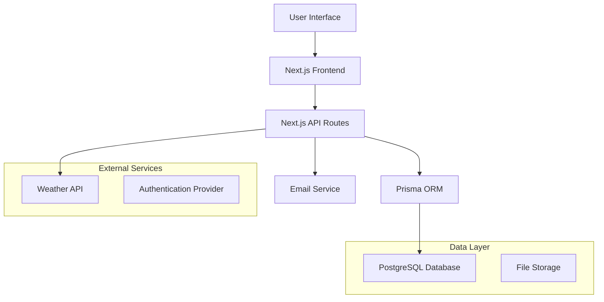

# 🏗️ Technical Specification - Football Field Reservation App

## 📋 System Architecture

### Overview
The application follows a modern full-stack architecture using Next.js for both frontend and backend, with PostgreSQL as the primary database and external weather API integration.



## 🗄️ Database Schema

### Core Models

```prisma
// User Management
model User {
  id            String        @id @default(cuid())
  email         String        @unique
  name          String
  phone         String?
  createdAt     DateTime      @default(now())
  updatedAt     DateTime      @updatedAt
  reservations  Reservation[]
  
  @@map("users")
}

// Football Fields
model Field {
  id            String        @id @default(cuid())
  name          String
  description   String?
  city          City
  address       String
  latitude      Float
  longitude     Float
  pricePerHour  Int           // in millimes (Tunisian currency)
  capacity      Int           // number of players
  surfaceType   SurfaceType
  facilities    String[]      // parking, showers, lighting, etc.
  images        String[]      // image URLs
  isActive      Boolean       @default(true)
  createdAt     DateTime      @default(now())
  updatedAt     DateTime      @updatedAt
  reservations  Reservation[]
  availability  FieldAvailability[]
  
  @@map("fields")
}

// Reservations
model Reservation {
  id            String            @id @default(cuid())
  fieldId       String
  userId        String
  date          DateTime
  startTime     DateTime
  endTime       DateTime
  totalPrice    Int
  status        ReservationStatus @default(PENDING)
  weatherData   Json?             // stored weather forecast
  notes         String?
  createdAt     DateTime          @default(now())
  updatedAt     DateTime          @updatedAt
  
  field         Field             @relation(fields: [fieldId], references: [id])
  user          User              @relation(fields: [userId], references: [id])
  
  @@map("reservations")
  @@unique([fieldId, date, startTime, endTime])
}

// Field Availability Templates
model FieldAvailability {
  id        String    @id @default(cuid())
  fieldId   String
  dayOfWeek Int       // 0 = Sunday, 6 = Saturday
  openTime  String    // "08:00"
  closeTime String    // "22:00"
  isActive  Boolean   @default(true)
  
  field     Field     @relation(fields: [fieldId], references: [id])
  
  @@map("field_availability")
}

// Weather Cache
model WeatherCache {
  id          String   @id @default(cuid())
  city        City
  date        DateTime
  weatherData Json
  createdAt   DateTime @default(now())
  expiresAt   DateTime
  
  @@unique([city, date])
  @@map("weather_cache")
}

// Enums
enum City {
  TUNIS
  ARIANA
  BEN_AROUS
}

enum SurfaceType {
  GRASS
  ARTIFICIAL_TURF
  CONCRETE
  INDOOR
}

enum ReservationStatus {
  PENDING
  CONFIRMED
  CANCELLED
  COMPLETED
}
```

## 🌤️ Weather API Integration

### OpenWeatherMap Integration

```typescript
interface WeatherData {
  city: City;
  date: string;
  temperature: {
    min: number;
    max: number;
    current: number;
  };
  humidity: number;
  precipitation: {
    probability: number; // percentage
    amount: number; // mm
  };
  wind: {
    speed: number; // km/h
    direction: string;
  };
  condition: WeatherCondition;
  description: string;
  icon: string;
}

enum WeatherCondition {
  CLEAR = 'clear',
  CLOUDY = 'cloudy',
  RAIN = 'rain',
  STORM = 'storm',
  SNOW = 'snow',
  FOG = 'fog'
}
```

### Weather Service Implementation

```typescript
class WeatherService {
  private apiKey: string;
  private baseUrl: string;

  constructor() {
    this.apiKey = process.env.OPENWEATHER_API_KEY!;
    this.baseUrl = 'https://api.openweathermap.org/data/2.5';
  }

  async getForecast(city: City, date: Date): Promise<WeatherData> {
    // Implementation with caching and error handling
  }

  async getCurrentWeather(city: City): Promise<WeatherData> {
    // Real-time weather data
  }
}
```

## 🔐 Authentication & Authorization

### NextAuth.js Configuration

```typescript
// auth.config.ts
export const authConfig = {
  providers: [
    CredentialsProvider({
      name: 'credentials',
      credentials: {
        email: { label: 'Email', type: 'email' },
        password: { label: 'Password', type: 'password' }
      },
      async authorize(credentials) {
        // Custom authentication logic
      }
    })
  ],
  callbacks: {
    jwt: async ({ user, token }) => {
      // JWT token customization
    },
    session: async ({ session, token }) => {
      // Session customization
    }
  }
};
```

## 📱 API Endpoints

### Field Management

```typescript
// GET /api/fields
// Query parameters: city, date, minPrice, maxPrice, facilities
interface GetFieldsResponse {
  fields: FieldWithAvailability[];
  pagination: {
    page: number;
    limit: number;
    total: number;
  };
}

// GET /api/fields/[id]
interface GetFieldResponse {
  field: FieldDetail;
  availability: TimeSlot[];
  weatherForecast: WeatherData[];
}

// POST /api/fields/[id]/reserve
interface CreateReservationRequest {
  date: string;
  startTime: string;
  endTime: string;
  notes?: string;
}
```

### Reservation Management

```typescript
// GET /api/reservations
interface GetReservationsResponse {
  reservations: ReservationWithField[];
  pagination: PaginationInfo;
}

// PUT /api/reservations/[id]
interface UpdateReservationRequest {
  status?: ReservationStatus;
  notes?: string;
}

// DELETE /api/reservations/[id]
// Cancellation logic with weather-based refund policy
```

### Weather API

```typescript
// GET /api/weather?city=TUNIS&date=2024-12-25
interface WeatherResponse {
  current: WeatherData;
  forecast: WeatherData[];
  playabilityScore: number; // 0-100 based on conditions
}
```

## 🎨 Frontend Architecture

### Component Structure

```
components/
├── ui/                 # Shadcn/ui base components
├── layout/            # Layout components
├── field/             # Field-related components
│   ├── FieldCard.tsx
│   ├── FieldDetail.tsx
│   ├── FieldFilter.tsx
│   └── FieldMap.tsx
├── reservation/       # Booking components
│   ├── ReservationForm.tsx
│   ├── ReservationCard.tsx
│   └── ReservationCalendar.tsx
├── weather/           # Weather components
│   ├── WeatherWidget.tsx
│   ├── WeatherForecast.tsx
│   └── PlayabilityScore.tsx
└── shared/           # Shared utilities
    ├── LoadingSpinner.tsx
    ├── ErrorBoundary.tsx
    └── Modal.tsx
```

### State Management

```typescript
// Context for global state
interface AppContextType {
  user: User | null;
  filters: FieldFilters;
  selectedDate: Date;
  weatherData: Record<string, WeatherData>;
}

// Custom hooks
const useFields = (filters: FieldFilters) => {
  // Field fetching and caching logic
};

const useWeather = (city: City, date: Date) => {
  // Weather data management
};

const useReservations = (userId: string) => {
  // User reservations management
};
```

## 🧪 Testing Strategy

### Test Structure

```
tests/
├── __mocks__/          # API and service mocks
├── unit/              # Unit tests
│   ├── utils/
│   ├── services/
│   └── hooks/
├── integration/       # API integration tests
│   ├── auth.test.ts
│   ├── fields.test.ts
│   └── reservations.test.ts
├── components/        # Component tests
│   ├── field/
│   ├── reservation/
│   └── weather/
└── e2e/              # End-to-end tests
    ├── booking-flow.test.ts
    └── user-journey.test.ts
```

### AI-Generated Test Examples

```typescript
// Weather service test
describe('WeatherService', () => {
  it('should cache weather data for 1 hour', async () => {
    // AI-generated test implementation
  });

  it('should handle API rate limiting gracefully', async () => {
    // Error handling test
  });
});

// Reservation validation test
describe('Reservation Validation', () => {
  it('should prevent double bookings', async () => {
    // Conflict detection test
  });

  it('should validate weather-based cancellations', async () => {
    // Business logic test
  });
});
```

## 🚀 Deployment & Infrastructure

### Vercel Deployment

```typescript
// vercel.json
{
  "functions": {
    "src/app/api/**/*.ts": {
      "maxDuration": 10
    }
  },
  "env": {
    "DATABASE_URL": "@database-url",
    "OPENWEATHER_API_KEY": "@weather-api-key",
    "NEXTAUTH_SECRET": "@nextauth-secret"
  }
}
```

### Environment Configuration

```env
# Database
DATABASE_URL="postgresql://..."
DIRECT_URL="postgresql://..."

# Weather API
OPENWEATHER_API_KEY="your-api-key"

# Authentication
NEXTAUTH_URL="https://your-domain.com"
NEXTAUTH_SECRET="your-secret"

# Email
SMTP_HOST="smtp.gmail.com"
SMTP_PORT="587"
SMTP_USER="your-email"
SMTP_PASS="your-password"
```

## 📊 Performance Considerations

### Optimization Strategies

1. **Database Optimization**
   - Index on frequently queried fields
   - Efficient pagination
   - Weather data caching

2. **API Performance**
   - Response caching
   - Rate limiting
   - Compression

3. **Frontend Optimization**
   - Image optimization
   - Component lazy loading
   - Bundle size optimization

### Monitoring & Analytics

```typescript
// Performance monitoring
const trackFieldView = (fieldId: string) => {
  // Analytics tracking
};

const trackReservation = (reservationData: ReservationEventData) => {
  // Conversion tracking
};
```

---

*This technical specification serves as the blueprint for implementing the football field reservation system with weather integration for Tunis.*